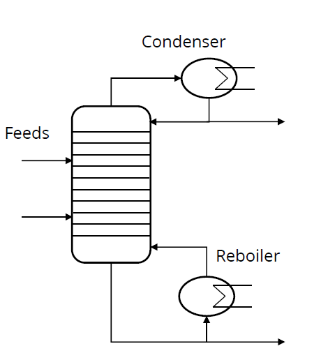

# Fast Intro to Rust

Let's have a 30 minute crash-course into Rust on the example of a **Distillation Column**.

- `trays` are the number of exchange areas between vapor/liquid, correlate with column height
- `feed_place` defines where the pipe is connected into the column, `we assume only one`
- `reflux_ratio` defines how much of the at the condenser is feed back to the column, 1 means 50%
- `d2f` defines how much of the feed goes out on the top of the column, 0.5 means 50%

## Agenda

1. Hello World
2. Variables and Data Structures
3. Methods and Traits
4. Derive Macros
5. Attribute Macros (example of an Async Runtime)

