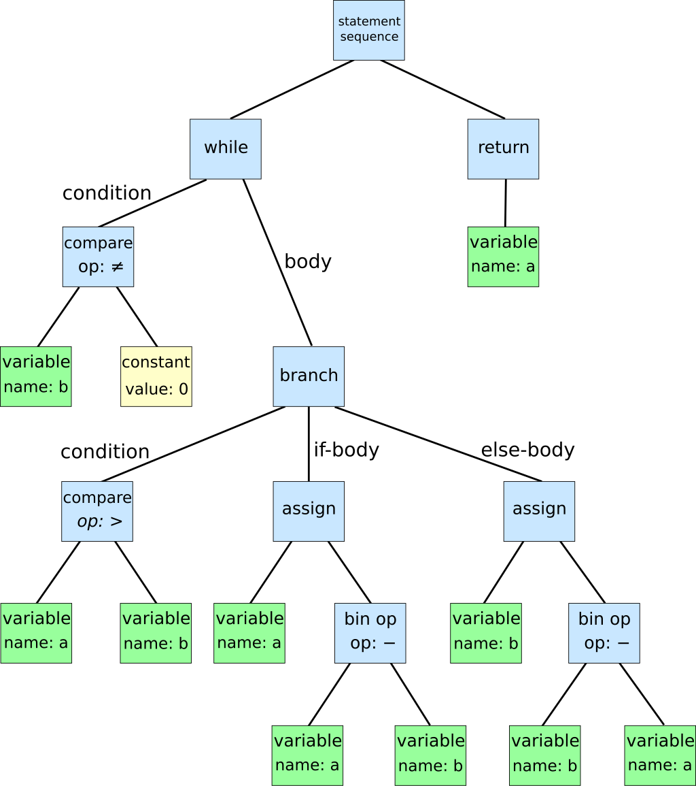

# Short Intro to Parsers

They work on an input-sequence (tokens) and based on a grammar they produce a structured representation called synatex tree.

- A huge field of research
- Common terms:
  - Token are the smalest unit of a parser, eg. `<=` two chars are the less-equal token
  - AST (abstract syntax tree)

```julia
while b ≠ 0:
    if a > b:
        a := a - b
    else:
        b := b - a
return a
```


